# Backend Features
# AI Native Programming Tutor — V1

**Stack:** FastAPI · Python 3.12 · PostgreSQL + pgvector · Anthropic Claude · OpenAI · Judge0 · Clerk  
**Last Updated:** 2026-06-06

---

## Table of Contents

1. [System Overview](#1-system-overview)
2. [Request Lifecycle](#2-request-lifecycle)
3. [Feature: Auth](#3-feature-auth)
4. [Feature: Authoring](#4-feature-authoring)
5. [Feature: Courses](#5-feature-courses)
6. [Feature: Enrollment](#6-feature-enrollment)
7. [Feature: Tutor](#7-feature-tutor)
8. [Shared Infrastructure](#8-shared-infrastructure)
9. [Data Model Relationships](#9-data-model-relationships)
10. [External Service Map](#10-external-service-map)

---

## 1. System Overview

The backend is a **vertical-slice FastAPI application**. Each feature owns its own `routes`, `service`, `schemas`, `models`, and `prompts`. Cross-feature imports are forbidden — features communicate only through the database.

```
app/
├── main.py               ← App factory · CORS · error handler · router registration
├── features/
│   ├── auth/             ← Identity · Clerk JWT · webhook
│   ├── authoring/        ← AI generation pipeline · publish
│   ├── courses/          ← Course + lesson read access
│   ├── enrollment/       ← Enroll by 6-char code
│   ├── tutor/            ← AI tutor interactions (SSE)
│   └── progress/         ← Block-level progress (models only, V1)
└── shared/
    ├── config.py         ← Pydantic Settings (reads .env)
    ├── db.py             ← Async SQLAlchemy session factory
    ├── deps.py           ← FastAPI deps: get_db · current_user
    └── errors.py         ← APIError · NotFoundError · ForbiddenError
```

**Module boundary rule:**

```
ALLOWED:   features/X  →  features/X   (own files)
ALLOWED:   features/X  →  shared/
FORBIDDEN: features/X  →  features/Y   (cross-feature import)
```

---

## 2. Request Lifecycle

Every protected request flows through the same pipeline before reaching a route handler.

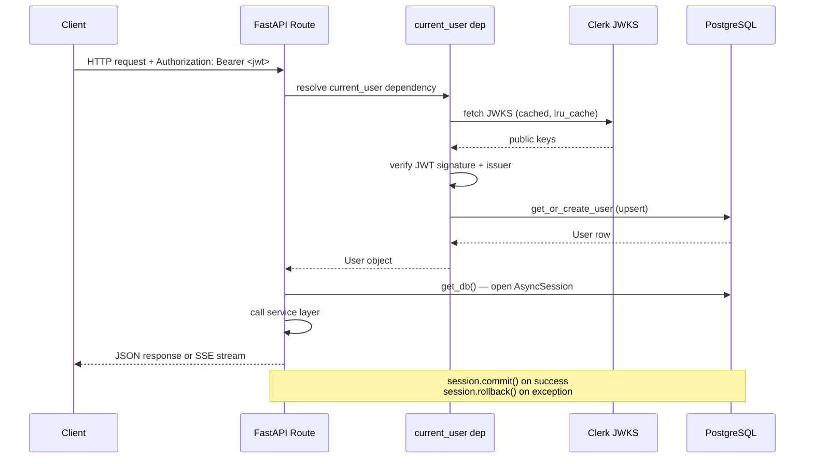

**Auth is enforced at the dependency layer**, not route-by-route. Every route that takes `user: User = Depends(current_user)` is automatically protected — a missing or invalid token returns `401` before the handler runs.

---

## 3. Feature: Auth

Handles user identity provisioning from Clerk, both on-request (JWT) and asynchronously (webhook).

### Endpoints

| Method | Path | Auth | Description |
|--------|------|------|-------------|
| `GET` | `/api/me` | JWT | Return current user profile |
| `POST` | `/api/auth/clerk-webhook` | SVIX signature | Sync `user.created` / `user.updated` from Clerk |

### Architecture

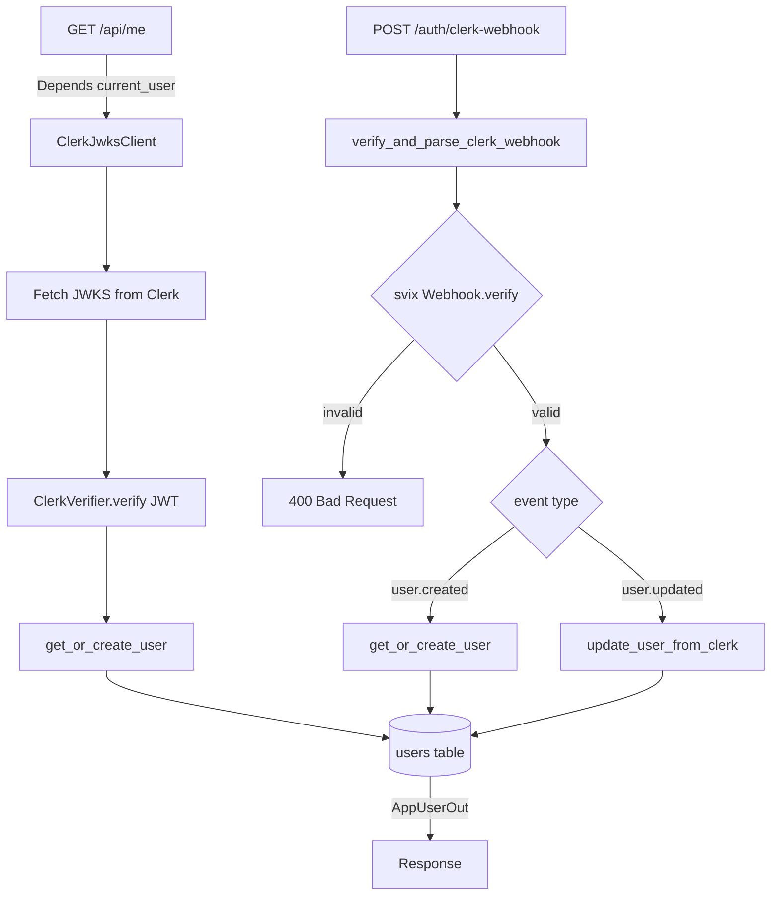

### Data Model

```
users
  id              UUID  PK
  clerk_user_id   VARCHAR(64)   UNIQUE  INDEX
  email           VARCHAR(254)  UNIQUE  INDEX
  display_name    VARCHAR(120)
  role            ENUM(student, creator)  DEFAULT student
  created_at      TIMESTAMPTZ
  updated_at      TIMESTAMPTZ
```

### Key Design Decisions

- **`lru_cache` on JWKS client** — JWKS keys are fetched once per process lifetime (until restart). Clock-drift or key rotation requires a restart or a process-level cache invalidation.
- **`get_or_create_user` on every request** — The webhook is the authoritative sync, but `current_user` also upserts so the first login always works even if the webhook fires late.
- **Role is app-managed** — Clerk does not control `role`. The app defaults every new user to `student`. Creator promotion happens out-of-band (direct DB or admin tool).

---

## 4. Feature: Authoring

Creators build courses from a PDF. This feature owns the entire AI generation pipeline and the course lifecycle from draft to published.

### Endpoints

| Method | Path | Auth | Description |
|--------|------|------|-------------|
| `POST` | `/api/courses` | JWT (creator) | Create course + start generation pipeline |
| `GET` | `/api/courses/{course_id}` | JWT (creator owner) | Get course with status |
| `POST` | `/api/courses/{course_id}/publish` | JWT (creator owner) | Publish course, assign 6-char code |
| `POST` | `/api/lessons/{lesson_id}/regenerate` | JWT (creator owner) | Regenerate a single lesson's blocks |

### Generation Pipeline

The pipeline runs **synchronously** on `POST /api/courses` and transitions `Course.status` at each step. `Course.generation_phase` tracks the current step for frontend polling.

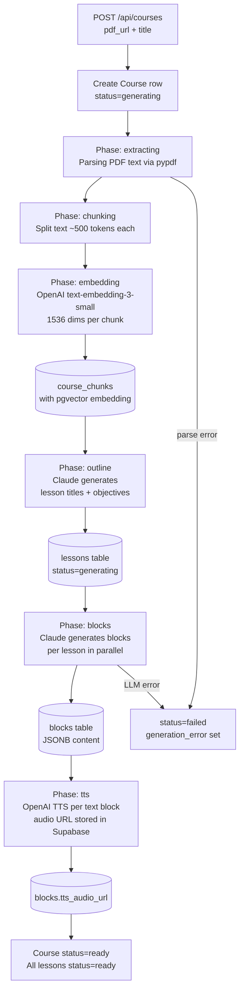

### Publish Flow

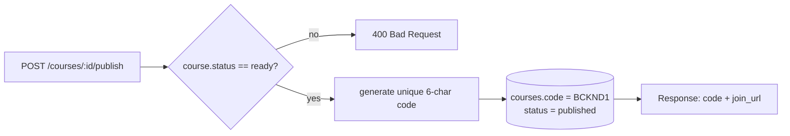

### Data Models

```
courses
  id                UUID  PK
  creator_id        UUID  FK→users
  code              VARCHAR(6)  UNIQUE  nullable until published
  title             TEXT
  description       TEXT
  default_language  VARCHAR(32)  DEFAULT 'python'
  source_pdf_url    TEXT
  custom_prompt     TEXT
  status            ENUM(draft|generating|ready|published|failed)
  generation_phase  ENUM(extracting|chunking|embedding|outline|blocks|tts)
  generation_error  TEXT
  total_lessons     INT
  total_blocks      INT
  created_at, updated_at

lessons
  id          UUID  PK
  course_id   UUID  FK→courses  CASCADE
  position    INT   UNIQUE(course_id, position)
  title       TEXT
  summary     TEXT
  objectives  TEXT[]
  status      ENUM(generating|ready|failed)
  created_at, updated_at

blocks
  id            UUID  PK
  lesson_id     UUID  FK→lessons  CASCADE
  position      INT   UNIQUE(lesson_id, position)
  type          ENUM(markdown|code|mermaid|concept_check|understanding_check)
  content       JSONB   ← structure varies by type (see §7)
  tts_audio_url TEXT
  created_at, updated_at

course_chunks
  id           UUID  PK
  course_id    UUID  FK→courses  CASCADE  INDEX
  content      TEXT
  embedding    Vector(1536)   ← pgvector
  chunk_index  INT
  page_number  INT
  created_at
```

### Block Content Shapes (JSONB)

Each `block.type` has a fixed content schema:

```jsonc
// markdown
{ "text": "A decorator is a function that wraps..." }

// code
{
  "instruction": "Write a decorator that logs function calls",
  "language": "python",
  "starter_code": "def log_calls(func):\n    pass",
  "expected_match": "exact",    // "exact" | "regex" | "ai_eval"
  "expected_output": "Calling greet\nHello!",
  "hint_seed_prompt": "..."     // STRIPPED before sending to client
}

// mermaid
{ "instruction": "...", "diagram": "graph TD\n  A --> B" }

// concept_check
{
  "question": "Can two threads safely increment a shared counter?",
  "options": ["Yes", "No", "Only with GIL"],
  "correct": "No",
  "explanation_correct": "Correct — no lock protects the mutation...",
  "explanation_wrong": "Incorrect — threads share memory space..."
}

// understanding_check
{
  "prompt": "Explain what a decorator is in your own words.",
  "evaluation_rubric": "...",   // STRIPPED before sending to client
  "threshold": "good"           // minimum level to pass
}
```

> **Security:** `hint_seed_prompt` and `evaluation_rubric` are never returned to the client.

---

## 5. Feature: Courses

Student-facing read access to published courses. Returns only courses the requesting user is authorized to see.

### Endpoints

| Method | Path | Auth | Description |
|--------|------|------|-------------|
| `GET` | `/api/courses` | JWT | List courses (enrolled for students, owned for creators) |
| `GET` | `/api/courses/{course_id}` | JWT | Course detail with lessons |

### Architecture

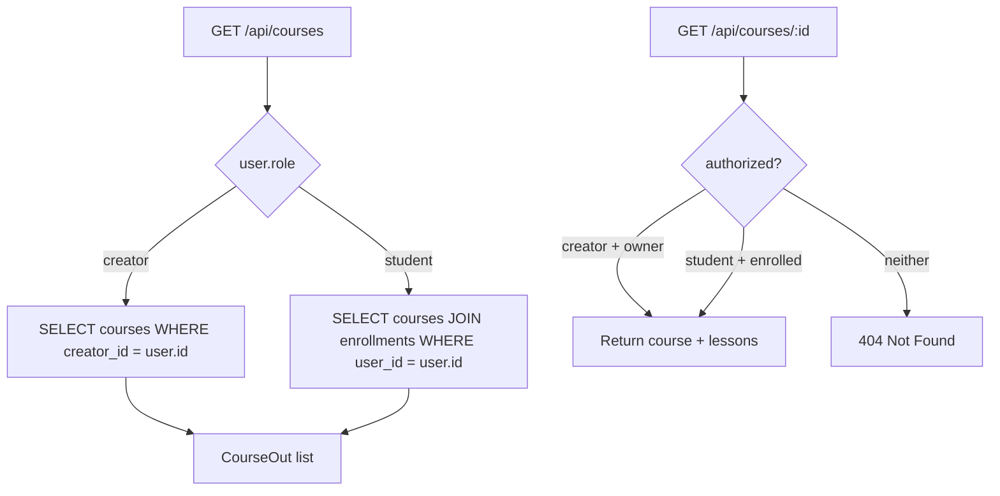

> Returning `404` (not `403`) on unauthorized course access is intentional — it avoids leaking course existence to non-enrolled users.

---

## 6. Feature: Enrollment

Students join a published course by its 6-character code.

### Endpoints

| Method | Path | Auth | Description |
|--------|------|------|-------------|
| `POST` | `/api/enrollments` | JWT | Enroll by `{ "code": "BCKND1" }` |
| `GET` | `/api/enrollments/{enrollment_id}` | JWT | Get enrollment + bookmark |

### Architecture

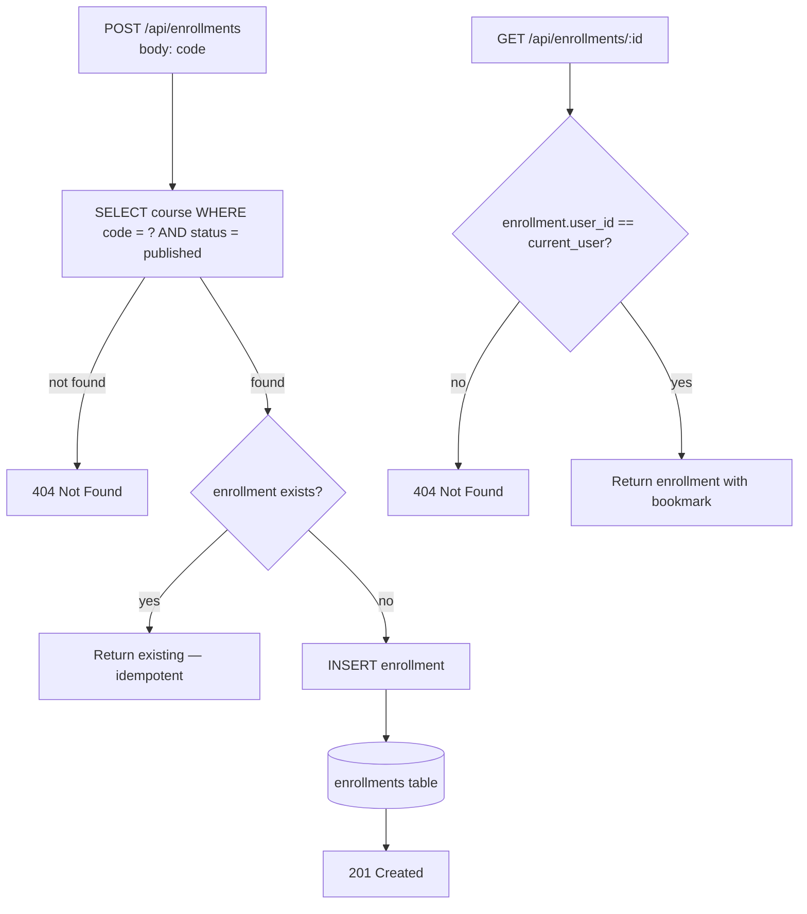

### Data Model

```
enrollments
  id                UUID  PK
  user_id           UUID  FK→users    CASCADE
  course_id         UUID  FK→courses  CASCADE
  UNIQUE(user_id, course_id)
  current_lesson_id UUID  FK→lessons  SET NULL
  current_block_id  UUID  FK→blocks   SET NULL
  started_at        TIMESTAMPTZ
  completed_at      TIMESTAMPTZ
```

---

## 7. Feature: Tutor

The live AI interaction layer. Four of the six endpoints produce SSE streams; two return JSON.

### Endpoints

| Method | Path | Auth | Response | Description |
|--------|------|------|----------|-------------|
| `GET` | `/api/lessons/{lesson_id}/blocks` | JWT | JSON | Fetch lesson blocks + progress |
| `POST` | `/api/blocks/{block_id}/run` | JWT | JSON | Execute code via Judge0 |
| `POST` | `/api/blocks/{block_id}/socratic-hint` | JWT | **SSE** | Stream Socratic hint |
| `POST` | `/api/blocks/{block_id}/understanding-check` | JWT | **SSE** | Stream understanding evaluation |
| `POST` | `/api/enrollments/{enrollment_id}/ask` | JWT | **SSE** | Stream RAG answer |
| `POST` | `/api/blocks/{block_id}/concept-check` | JWT | JSON | Check MCQ answer |

### Code Execution Flow

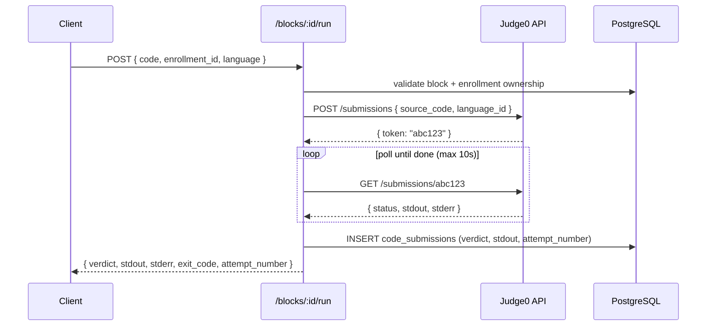

### Socratic Hint Flow

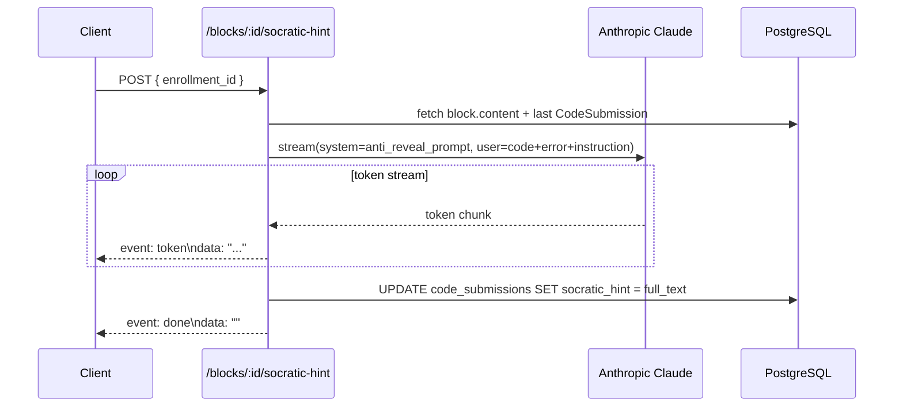

### Ask Anything — RAG Flow

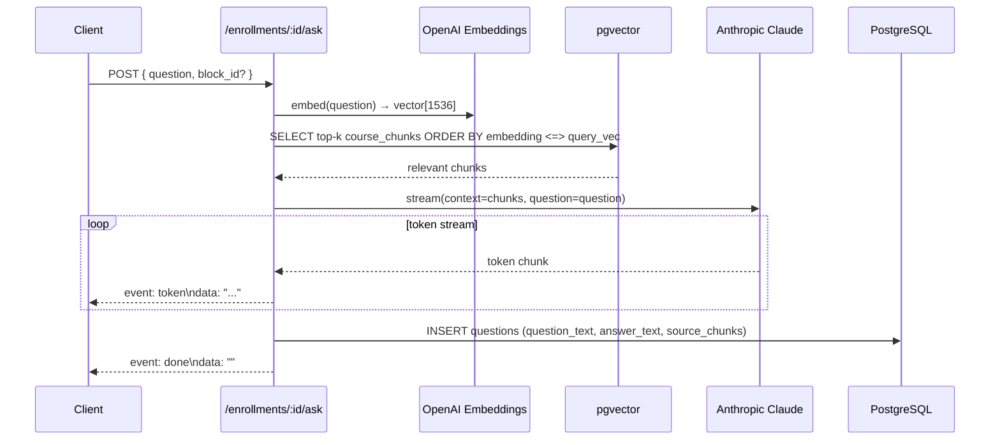

### Understanding Check Flow

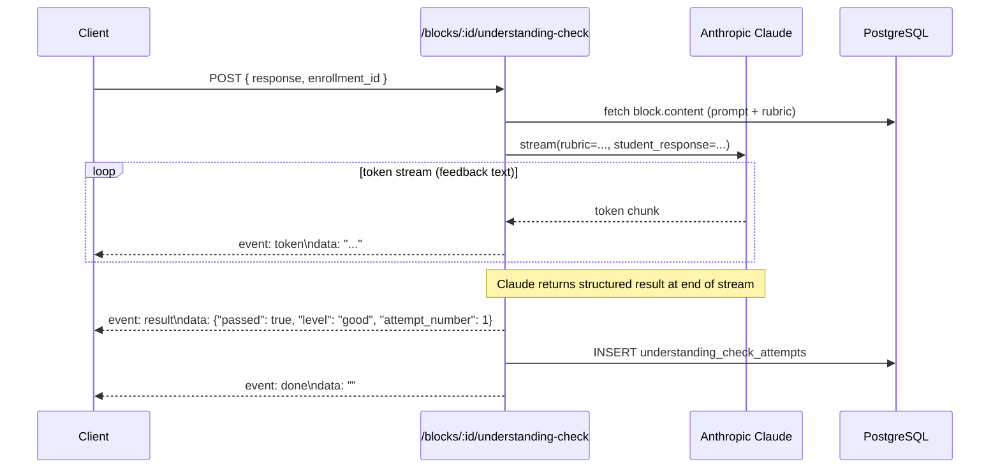

### SSE Event Reference

| Event | Data | Fired by |
|-------|------|----------|
| `token` | Plaintext string chunk | All SSE endpoints |
| `result` | JSON: `{ passed, level, attempt_number }` | `understanding-check` only |
| `error` | Error message string | All SSE endpoints on failure |
| `done` | `""` (empty) | All SSE endpoints — always last |

### Data Models

```
code_submissions
  id             UUID  PK
  enrollment_id  UUID  FK→enrollments  CASCADE  INDEX
  block_id       UUID  FK→blocks       CASCADE  INDEX
  code           TEXT
  language       VARCHAR(32)
  judge0_token   VARCHAR(64)
  stdout, stderr TEXT
  exit_code      INT
  verdict        ENUM(passed|failed|runtime_error|compile_error|error)
  socratic_hint  TEXT
  attempt_number INT  DEFAULT 1

concept_check_attempts
  id             UUID  PK
  enrollment_id  UUID  FK→enrollments  CASCADE  INDEX
  block_id       UUID  FK→blocks       CASCADE  INDEX
  selected_answer  TEXT
  is_correct       BOOLEAN
  explanation      TEXT
  attempt_number   INT  DEFAULT 1

understanding_check_attempts
  id             UUID  PK
  enrollment_id  UUID  FK→enrollments  CASCADE  INDEX
  block_id       UUID  FK→blocks       CASCADE  INDEX
  response       TEXT
  level          ENUM(poor|fair|good|excellent)
  feedback       TEXT
  passed         BOOLEAN
  missing_points TEXT[]
  attempt_number INT  DEFAULT 1

questions
  id             UUID  PK
  enrollment_id  UUID  FK→enrollments  CASCADE  INDEX
  block_id       UUID  FK→blocks  SET NULL  (null = global question)
  question_text  TEXT
  answer_text    TEXT
  source_chunks  JSONB   ← pgvector result metadata
  created_at, updated_at

block_progress
  id             UUID  PK
  enrollment_id  UUID  FK→enrollments  CASCADE  INDEX
  block_id       UUID  FK→blocks       CASCADE
  UNIQUE(enrollment_id, block_id)
  status         ENUM(not_started|in_progress|completed)
  completed_at   TIMESTAMPTZ
  created_at, updated_at
```

---

## 8. Shared Infrastructure

### `shared/deps.py`

Two FastAPI dependencies used by every route:

| Dependency | Returns | Behavior |
|------------|---------|----------|
| `get_db()` | `AsyncSession` | Opens session, commits on success, rolls back on any exception |
| `current_user()` | `User` | Verifies Clerk JWT → upserts user → returns `User` row |

### `shared/config.py`

`Settings` extends Pydantic `BaseSettings`. All values read from `.env`. Required (no default) env vars:

```
DATABASE_URL           postgresql+asyncpg://...
CLERK_PUBLISHABLE_KEY
CLERK_SECRET_KEY
CLERK_JWKS_URL
CLERK_WEBHOOK_SECRET
ANTHROPIC_API_KEY
OPENAI_API_KEY
JUDGE0_API_KEY
SUPABASE_SERVICE_ROLE_KEY
```

Optional with defaults:

```
JUDGE0_API_URL     https://judge0-ce.p.rapidapi.com
SUPABASE_URL
FRONTEND_URL       http://localhost:3000
APP_ENV            development
LOG_LEVEL          INFO
```

### `shared/errors.py`

```
APIError (HTTPException)
  ├── NotFoundError   → 404
  ├── ForbiddenError  → 403
  └── GenerationError → 500
```

The `app.exception_handler(APIError)` in `main.py` renders all subclasses as `{ "detail": "message" }`.

---

## 9. Data Model Relationships

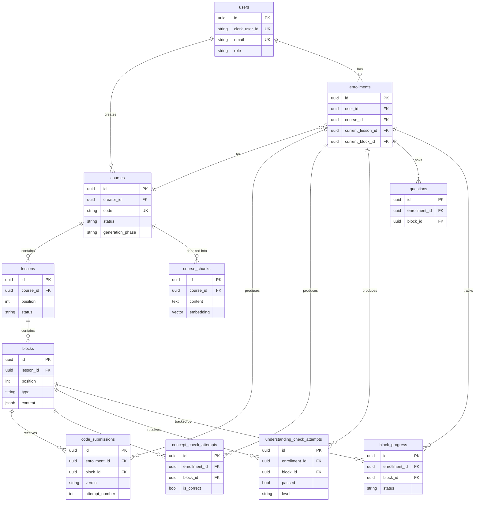

---

## 10. External Service Map

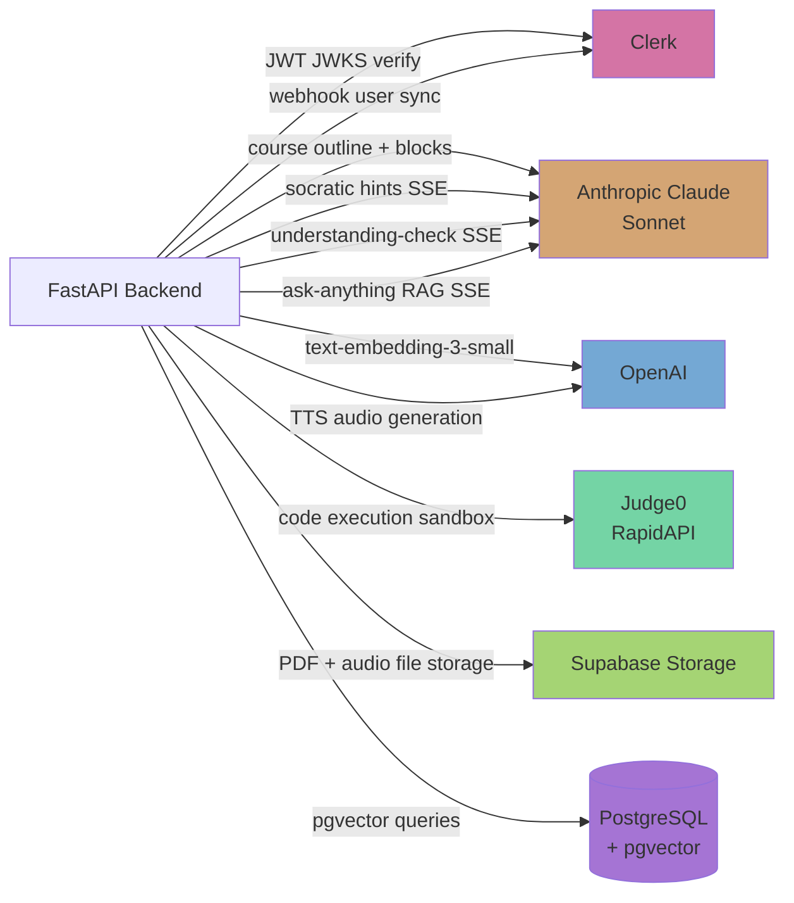

| Service | Operations |
|---------|------------|
| **Clerk** | JWT signature verification (JWKS), user webhook (`user.created`, `user.updated`) |
| **Anthropic Claude** | Generation pipeline (outline, blocks), Socratic hints, understanding check eval, RAG Q&A |
| **OpenAI** | `text-embedding-3-small` for chunks + questions, `tts-1` for audio |
| **Judge0** | Sandboxed code execution, 60+ languages, no infra |
| **Supabase Storage** | PDF source files, TTS audio files |
| **PostgreSQL + pgvector** | All structured data + cosine similarity search on embeddings |
