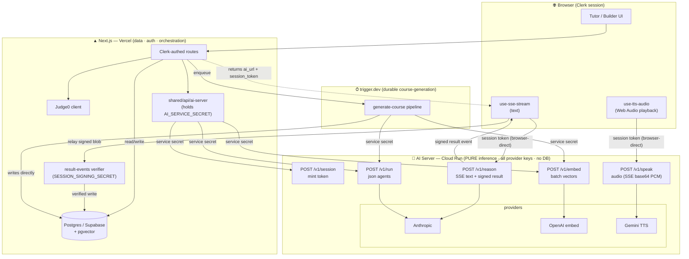

# AI Service Extraction — Design

**Date:** 2026-06-08
**Status:** Approved for planning
**Goal:** Extract all AI/model inference into a standalone, stateless AI server (no database) that streams reasoning and audio directly to the browser. Next.js (on Vercel) owns all data, auth, and orchestration. Designed to be lifted into a fresh repo as the primary AI microservice and to host many future agents.

---

## 1. Guiding Principle

> **The AI server does model inference ONLY. Anything that is not a call to an LLM/model provider stays out of it. The AI server never reads or writes a database — it produces data; Next (or trigger.dev) persists it.**

Corollaries:
- The AI server is **stateless** and **horizontally scalable** — no DB, no session storage. Any instance can serve any request behind a load balancer.
- The AI server holds **all** provider keys (Anthropic, OpenAI-for-embeddings, Gemini-for-TTS). Next and trigger.dev hold **zero** provider keys.
- The AI server never calls back into Next today (the general tool-callback loop is deferred — see §7).

---

## 2. Topology — Three Trusted Surfaces

```
┌─────────────────────────────────────────────────────────────────────────┐
│ Browser                                                                   │
│   - Clerk session (user identity)                                         │
│   - opens SSE/audio streams DIRECT to AI server using a session token     │
└───────────┬───────────────────────────────────────────────┬─────────────┘
            │ Clerk-authed requests                          │ session-token streams
            ▼                                                ▼
┌───────────────────────────────────┐          ┌──────────────────────────────┐
│ Next.js (Vercel, serverless)       │  service │ AI Server (GCP/AWS, always-on)│
│  - Clerk auth (verify user)        │  secret  │  - PURE inference             │
│  - Postgres/Supabase (all data r/w)│─────────▶│  - all provider keys          │
│  - pgvector cosine SEARCH          │          │  - stateless, no DB           │
│  - Judge0 code execution           │          │  - mints session tokens       │
│  - mint session (via AI /session)  │          │  - LangGraph-ready runtime    │
│  - verify signed result events     │          │                               │
└───────────┬───────────────────────┘          └───────────▲──────────────────┘
            │ shares DB schema/client                       │ service secret
            ▼                                                │  /embed + /run
┌───────────────────────────────────┐                       │
│ trigger.dev (durable jobs)         │───────────────────────┘
│  - course-generation pipeline      │
│  - calls AI /embed + /run          │
│  - writes DB directly              │
│  - holds service secret, NO        │
│    provider keys                   │
└───────────────────────────────────┘
```

**Hosting:**
- **Next.js** → Vercel (serverless). Short request durations are fine because no long job or long stream runs *through* Next.
- **AI server** → GCP Cloud Run / AWS ECS-Fargate (always-on container). Every endpoint is bounded (seconds), including streams.
- **trigger.dev** → managed (self-hostable). Runs the only long-running work.

### Architecture diagram



---

## 3. Security Model — Two Credentials

| Credential | Type | Who holds it | Used for | Reaches browser? |
|---|---|---|---|---|
| `AI_SERVICE_SECRET` | Static random string | Next + trigger.dev (env) | Server→AI calls (`/session`, `/run`, `/embed`) | **Never** |
| Session token | Short-lived JWT (HS256), signed by AI server with `SESSION_SIGNING_SECRET` | Minted per stream, relayed via Next to browser | Browser→AI streams (`/reason`, `/speak`) | Yes (short-lived, scoped) |

**Why two:** the static secret authenticates trusted backends and never touches the client; the session token is a disposable, expiring, scoped capability that the browser uses to open exactly one stream.

**Session token claims:** `{ agent, server_context (sealed), exp (~2–5 min), iat, jti }`. Verified statelessly (signature + expiry). No DB lookup.

**Secret-context rule:**
- **Server-side / secret context** (understanding-check rubric, RAG chunks) → assembled by Next, **sealed inside the session token**. The browser relays it but cannot read it.
- **Client-side / non-secret context** (student code, Judge0 stdout/stderr) → sent by the browser in the stream POST body.
- The AI server merges both at stream time.

> Sealing context in the JWT keeps the AI server stateless. Payloads are a few KB (fine). If a payload ever grows large, fall back to an opaque server-side handle — not built now.

**Provider keys** live only on the AI server. Even Judge0 (not a provider, but an external credential) stays on Next.

---

## 4. AI Server API (versioned `/v1`)

| Endpoint | Auth | Streaming | Purpose |
|---|---|---|---|
| `POST /v1/session` | service secret | no | Validate caller, mint session token sealing `{agent, server_context}` |
| `POST /v1/reason` | session token | **yes — text SSE** | Tutor reasoning: socratic, understanding-check, ask |
| `POST /v1/speak` | session token | **yes — audio** | On-demand Gemini TTS |
| `POST /v1/run` | service secret | no | Server-to-server JSON inference: outline, generate-blocks, agent-edit, code-eval |
| `POST /v1/embed` | service secret | no | Embeddings (single + **batch**) for RAG and pipeline chunking |
| `GET  /v1/healthz` | none | no | Liveness |

**Two auth classes by connector:**
- **Browser-direct** (`/reason`, `/speak`) → session token. The only long-lived connections.
- **Server-to-server** (`/session`, `/run`, `/embed`) → service secret. JSON in/out; browser never involved.

`/embed` accepts a batch (`texts: string[] → vectors: number[][]`) so the pipeline embeds many chunks in one round-trip.

---

## 5. Agent Registry (config, not endpoints)

Agents are configuration entries — `name → { model, system_prompt, params, streaming, mode }` — resolved by `/reason` and `/run`. Adding an agent = a new registry entry, not a new endpoint or redeploy of routing logic.

**Agents at migration:**

| Agent | Endpoint | Mode | Model (current) |
|---|---|---|---|
| `socratic` | `/reason` | text stream | claude-sonnet-4-6 |
| `understanding-check` | `/reason` | text stream + signed result | claude-sonnet-4-6 |
| `ask` | `/reason` | text stream + signed result | claude-sonnet-4-6 |
| `code-eval` | `/run` | json | claude-haiku-4-5 |
| `agent-edit` | `/run` | json | claude-sonnet-4-6 |
| `outline` | `/run` | json | claude-opus-4-8 |
| `generate-blocks` | `/run` | json | claude-opus-4-8 |

Capabilities (not agents): `/embed` (OpenAI text-embedding-3-small), `/speak` (Gemini TTS).

---

## 6. Internal Layering (LangGraph-ready)

```
transport/   FastAPI · SSE/audio responses · auth (token + service secret) · /v1 versioning
runtime/     agent runtime → TODAY: single-turn executor · LATER: LangGraph (drop-in swap)
agents/      registry: name → { model, system_prompt, params, mode }
providers/   adapters: anthropic · openai(embed) · gemini(tts) — routed by capability
security/    token mint/verify · service-secret check · signed-result-event signing
```

The runtime engine is swappable without touching transport, auth, or the provider adapters. Today's features are the degenerate single-turn case of the same runtime.

---

## 7. Orchestration Strategy & Deferral

Two distinct kinds of orchestration:
- **Workflow orchestration** — fixed durable step sequence (course generation). → **trigger.dev.**
- **Agent orchestration** — LLM-driven reasoning loop / tool-use / multi-agent. → **LangGraph, AI-side**, future.

**Deferred (YAGNI):** the general reverse tool-callback channel (AI → Next tool API) and the LangGraph engine. No current feature needs a reasoning loop — RAG and Judge0 run in Next *before* the single AI call. `/reason` and `/run` response shapes will *allow* a future tool-call decision, but no tool registry/executor is built now. The first multi-step agent (e.g. an interactive course-creation assistant) adds it as a LangGraph graph; transport, auth, and streaming stay untouched.

---

## 8. Persistence — "AI Never Writes"

The AI server produces results; something with DB access persists them. Two relay paths, chosen by whether an untrusted client sits in the middle:

**A. Signed result events (streams through the browser).**
At end of stream, the AI server emits a **signed event** (HMAC/JWT over the result payload using `SESSION_SIGNING_SECRET`), e.g. `{ level, passed, feedback }` for understanding-check, or `{ question, answer, source_chunk_ids }` for ask. The browser relays the signed blob to a Next endpoint; **Next verifies the signature and writes.** The student cannot forge `passed` — they cannot sign it.

**B. Direct DB write (trusted server-to-server, no browser).**
trigger.dev (pipeline) and Next (`code-eval`, `agent-edit`, `concept-check`) write their own DB directly after calling the AI server. No signing needed — no untrusted client in the path.

---

## 9. Per-Feature Data Flow

**Stays 100% in Next — not AI at all:**
- `GET /lessons/{id}/blocks` — DB read + `strip_sensitive_fields`.
- `concept-check` — pure comparison `selected_answer == correct_index`. (Only lived in the tutor service by accident.)

**Streaming (browser-direct):**

| Feature | Flow |
|---|---|
| **socratic hint** | Next loads last submission + block (server-side) → seals in token → mints session → browser opens `/reason` stream. Browser sends nothing secret. |
| **understanding-check** | Next loads rubric (secret) → seals → mint → browser streams `/reason`. AI emits **signed result event** → browser relays → Next verifies + writes attempt. |
| **ask-anything** | Next: AI `/embed` query → pgvector search own DB → seal top-K chunks → mint → browser streams `/reason`. AI emits **signed result event** (Q+A+chunk ids) → Next verifies + writes. |
| **TTS** | Block text already on screen → browser → Next mints session (auth only, no secret) → browser streams `/speak` → Gemini audio chunks. On-demand only. |

> **`/speak` contract (settled 2026-06-08).** TTS is the "text already complete" case — the browser already has the full text on screen and asks `/speak` to read it aloud. No live Claude→Gemini sentence-pipelining is built (deferred; would only matter for a future realtime conversational voice tutor). To stay drop-in compatible with the existing `use-tts-audio.ts` player, `/speak` MUST:
> - Emit **SSE lines** `data: {"type":"audio","mimeType":...,"data":<base64>}` (NOT raw `audio/mpeg` bytes), terminated by `data: [DONE]`.
> - Produce **24 kHz PCM** chunks (the player decodes Int16 PCM at 24000 Hz).
> - Use model `gemini-3.1-flash-tts-preview` with `responseModalities:['audio']` and a `speechConfig` voice (default `voiceName: 'Achernar'`), matching the pre-extraction route.
> - Accept selectable `voice` and `style` as **allowlisted enums** (never free text — free text in the director's-note prompt is a prompt-injection vector). Playback speed (0.5×–1.5×) stays fully client-side (`playbackRate`).
>
> The Task-17 implementation built in Phase 3 streams raw bytes with no voice config; it MUST be reconciled to this contract during Phase 4 TTS wiring before the old route is deleted.

**Server-to-server (no browser):**

| Feature | Flow |
|---|---|
| **run_code** | Next runs Judge0 → on `needs_ai_eval`, Next calls `/run` (`code-eval`) → Next writes submission. |
| **agent-edit** | Next loads blocks → `/run` (`agent-edit`) → Next writes block updates. |

**Durable job (trigger.dev):**

| Feature | Flow |
|---|---|
| **course generation** | Next enqueues a trigger.dev job → job: download PDF, extract, chunk (TS) → AI `/embed` (batch) → write chunks → AI `/run` (`outline`) → write lessons → AI `/run` (`generate-blocks`) per lesson (concurrency-controlled by trigger.dev) → write blocks → set status ready. Writes DB directly; updates `generation_phase` for browser polling. **No TTS phase.** |

---

## 10. What Gets Removed / Changed

**Removed:**
- Server-side block-audio pre-generation (`_generate_tts` in pipeline + `tts_audio_url` population). TTS becomes on-demand only via `/speak`.
- `/api/tts/stream` (old pre-gen audio endpoint).
- Clerk verification on the AI side (`clerk.py` does not move to the AI server).
- Provider keys from Next/pipeline env.

**Changed:**
- Tutor/builder/authoring AI calls → calls to the AI server (`/reason`, `/run`, `/embed`).
- RAG: embedding via AI `/embed`; cosine search remains a Next DB query.
- Authoring pipeline → trigger.dev (TypeScript), replacing `asyncio.Semaphore` + `retry_async` with trigger.dev concurrency/retries/observability.
- `_ai_eval_verdict` → `code-eval` agent via `/run`.

**Unchanged:**
- Clerk auth at the Next layer (user identity).
- Judge0 execution in Next.
- Existing `use-sse-stream.ts` POST-with-streamed-body pattern (token + client context go in the POST body).
- `generation_phase` progress model (relocated to trigger.dev writes).

---

## 11. Scalability Practices (baked in from day one)

- **Stateless + horizontally scalable** — self-verifying session tokens; any instance serves any request.
- **Versioned API** (`/v1/…`).
- **Agent registry as config** — new agent = new entry.
- **Provider adapters behind interfaces** — swap/add models per agent without touching routes.
- **Request-ID propagation** (Next/trigger.dev → AI → logs) + standardized provider-call timeouts/retries.
- **Batch `/embed`** to minimize round-trips.

---

## 12. Migration Strategy

Build in place in the current repo, then lift the AI server folder into a fresh repo.

1. **AI server skeleton** — `/v1` transport, auth (service secret + session token mint/verify), provider adapters, agent registry, single-turn runtime, `/healthz`.
2. **`/embed` + `/run`** — server-to-server inference. Migrate `code-eval`, `agent-edit`, `outline`, `generate-blocks`.
3. **`/session` + `/reason`** — streaming reasoning + signed result events. Migrate socratic, understanding-check, ask. Wire Next context assembly + token sealing + result verification/writes.
4. **`/speak`** — on-demand Gemini TTS, browser-direct audio.
5. **trigger.dev pipeline** — port PDF→embed→outline→blocks to a durable job; remove TTS phase; delete old pipeline + provider keys from Next.
6. **Cleanup** — strip Clerk/provider deps from the AI-server folder; verify zero provider keys in Next/trigger.dev; confirm AI server has no DB import.
7. **Lift** — move the AI-server folder to the new repo; deploy to GCP/AWS.

---

## 13. Open Risks / Notes

- **trigger.dev vs Inngest** — equivalent; pick on DX after a short evaluation. trigger.dev chosen as default (TS-native, self-hostable).
- **Session-token size** — sealed RAG chunks inflate the token; fine at a few KB. Fallback = opaque server-side handle if ever large.
- **Gemini TTS latency/cost** — on-demand only; monitor. Browser `SpeechSynthesis` remains a zero-cost fallback if needed.
- **Signed result events** — must use a constant-time signature check on the Next verify endpoint.
